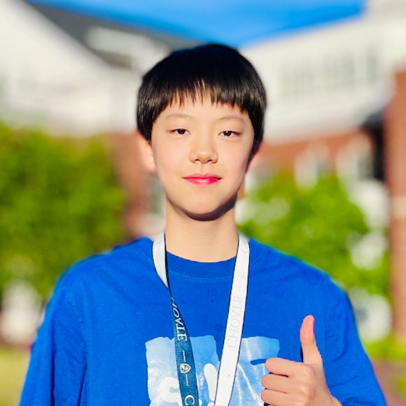

  
  <h1>😝 Hullo, I'm July 😝</h1>
  <h2>I'm a student coder 💻, a swimming athlete 🏊, and a music-lover 🎧</h2>

 

  > **Note:** July updates the below information manually every day!
 

**Last Active: Jan 30**

**How Long Have I Been On Github: 100 days**
 

___

### 👀 About me
- 👀 I enjoy coding, sports, reading, hiking, and listening to music.
- 💞️ I’m looking to collaborate on anything I like. That means basically anything is fine.  
- 😄 Pronouns: You decide  
- 💻 I'm proficient in Python, JavaScript and HTML5.  
- 🌱 I’m currently learning C++, PHP, and CSS3.
- 🧑‍💻 I'm currently working on [🚁 ChopperDash](https://github.com/JLW-7/helicopter-game), a simple helicopter game.
- 📫 How to reach me: email [july.777.wu@gmail.com](mailto:july.777.wu@gmail.com) or [toothless2012.pp@gmail.com](mailto:toothless2012.pp@gmail.com)
- 🍄 Fun fact: I hate mushrooms...
 

### 🛠️ Tech Stack
- **Languages**:
       
- **Tools:** Git, VSCode, Pycharm, Replit
- **Frameworks/Libraries:** Django, Flask, React, Bootstrap
 

### 📁 Projects
- [Numera](https://github.com/JLW-7/Numera-Calculator-Website), a versatile calculator website for performing everyday calculations (e.g. simple math, BMI, average).
- [ChopperDash](https://github.com/JLW-7/helicopter-game-in-javascript), a helicopter game where users avoid obstacles and collect coins to earn points.
- [Solace Project](https://github.com/JLW-7/Solace-Emotional-Support-Website), an emotional support website for bullying victims and people with mental health challenges.
 

### 🔗 Connect With Me
- LinkedIn: [July Wu](https://www.linkedin.com/in/july-wu-85b3052a1/)
- Portfolio (Coming Soon): [julyw.com](https://github.com/JLW-7)
- Email: [july.777.wu@gmail.com](mailto:july.777.wu@gmail.com) or [toothless2012.pp@gmail.com](mailto:toothless2012.pp@gmail.com)
 

### 🐙 Github Stats
 

<!---
JLW-7/JLW-7 is a ✨ special ✨ repository because its `README.md` (this file) appears on your GitHub profile.  
You can click the Preview link to take a look at your changes.  
--->

